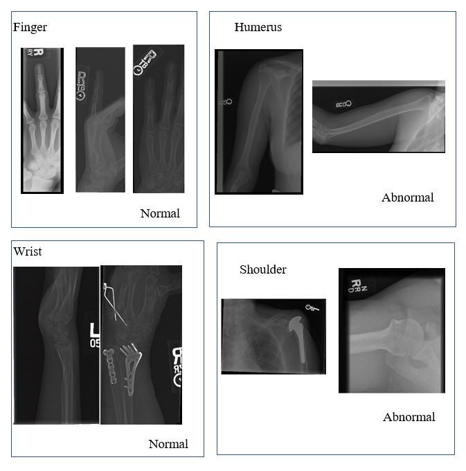

# Ensemble-Based-Neural-Network-for-theClassification-of-MURA-Dataset
Musculoskeletal Radiographs (MURA) dataset, proposed by Stamford MachineLearning (ML) group, contains 40,561 images of bone X-rays from 14,863 studies.The X-ray images belong to seven body areas of upper extremity- Wrist, Elbow,Finger, Humerus, Forearm, Hand, and Shoulder. The data are classified manually byradiologists into two classes- normal or abnormal. These data samples are labeledusing majority vote by six board-certified Stanford radiologists. The majority votesof these radiologists’ labels are considered as gold standard. The presence of suchrich,complex and diverse labeled dataset inspires to build an accurate but simplermodel for bone anomaly detection. The model proposed by Stamford ML group isa 169 layer deep computationally complex Neural Network (NN), that requires aGraphical Processing Unit (GPU) for implementation. This leads to the necessityof smaller neural network based model that are executable on general purposecomputers. Moreover, the 169 layer deep model works well on par with the goldstandard except for the humerus radiographs, despite the presence of humerusdata labeled with high accuracy. Therefore, in this work we propose an ensembleof smaller neural networks and convolution neural network for highly accurateclassification of MURA study images of humerus.  We use Adaboost algorithmto train this model.  The performance of this model is evaluated using trainingerror, validation error, and Cohen’s kappa coefficients. The model is available in this repo.

Some of the images in the X-rays are given following:

![Figure 1: MURA dataset contains 14863 images of the radiography of musculoskeletal studies of theupper extremity. In each of the study multiple views are manually labeled by radiologists. Right sideof the above Figure explains some normally labeled images of Elbow and Wrist, respectively whereinleft side describes some abnormal images from the Humerus and Shoulder, respectively.which we can notice in some of the images from Fig. 1. Mistreatment due to the misclassification isthus critical in any situation for that patient.MURA is a large dataset of musculoskeletal radiographs recently proposed by Stamford MachineLearning (ML) group.  This dataset can help train and create accurate models for classification inradiographic studies. It contains 14,863 studies with 40,561 images. Each study in the data containsmultiple views of the targeted body part, which are labeled by radiographers as normal or abnormal.These are high resolution images that make the size of the whole dataset around 3.3 GB. The largesize of this dataset and the crucial accuracy requirements of the radiographic study sector requiresneural network based approaches.The Stamford ML group proposed a 169 layer deep neural network model of dense layers to reliablyclassify the MURA dataset. This model classifies most of the X-ray images of different body partswith high degree of agreement with the radiologist classifiers (gold standard). However, it shows lowagreement with gold standard for finger and humerus dataset. In case of the finger dataset, Rajpurkaret al. [2018] shows that the existing finger dataset labels had low value of Cohen’s kappa coefficient.This causes the model to perform poorly.  However, for humerus data, despite presence of highlyaccurate labels the model performs poorly.  Moreover, the computational complexity of this deepneural network model requires a GPU to execute.  In order to address these two issues, this workpresents an ensemble model of 12 layered neural networks. This model can run on a general purposecomputer without the necessity of a GPU. But to get the full advantage of the model, we require somehigh performing computer(HPC) due to the large size of the image. We also build an autoencoderwith Convolution Neural Network(CNN). The testing and training has been carried out on humerusdataset only.The following part of this paper is organized as- section 2 describes the details of MURA dataset,section 3 describes the proposed ensemble model, section 4 contains the model interpretation, section5 compares the performance of the proposed model with Stamford ML group’s model, section 6describes the related works and section 7 discusses the overall findings.2
]()
